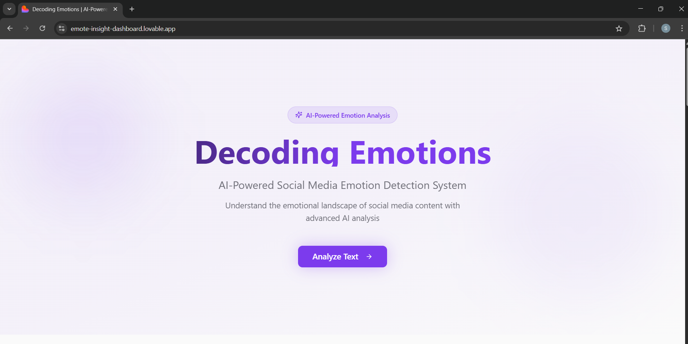
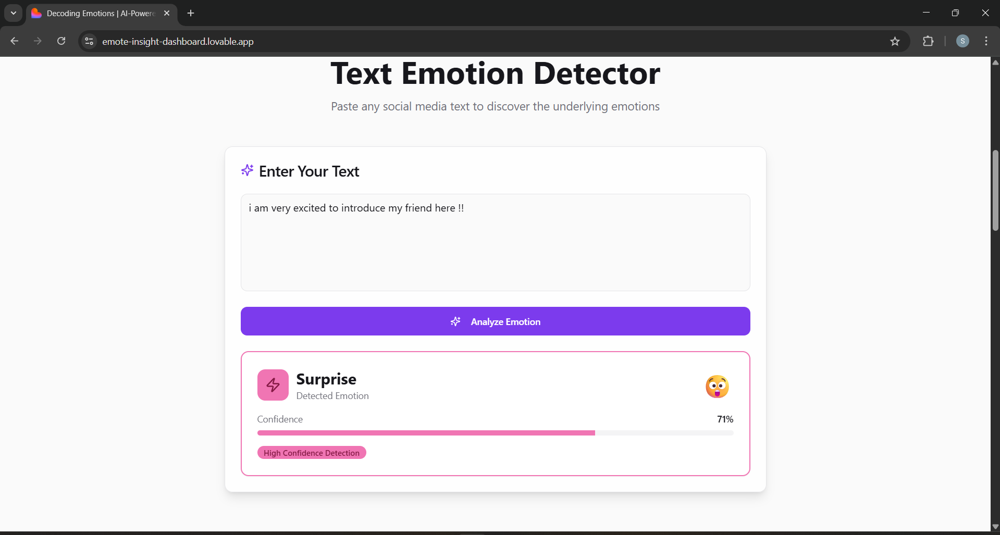
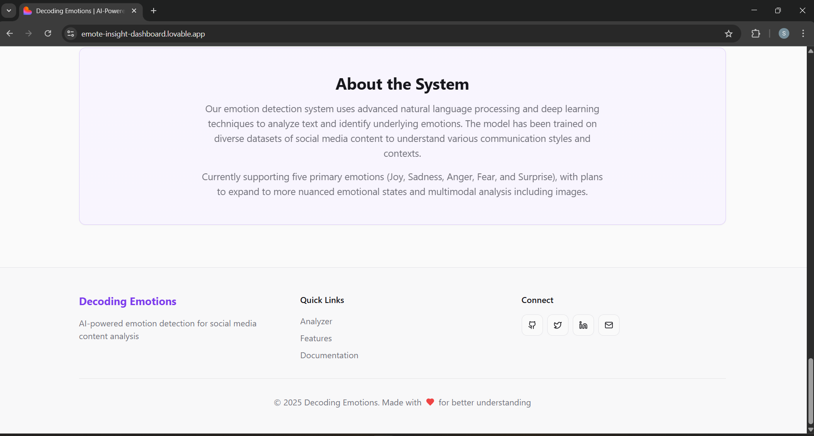

##  Emote Insight – Emotion Sense Detection Dashboard

✨ **Emote Insight** is an AI-powered dashboard that detects and visualizes human emotions from text, voice, or facial expressions. It provides real-time analysis, emotion trends, and insights through an interactive and clean UI.
---
🔗 Live Demo

👉 Website:https://emote-insight-dashboard.lovable.app

👉 GitHub Repository:https://github.com/Sandhiyamrs/emote-insight-dashboard.git

---

## 🌈 Features
- Real-time emotion detection
-Text / Voice / Facial emotion analysis
-Emotion charts & distribution
-Timeline view of emotional changes
-Session summary & dominant emotion
-Clean, interactive dashboard UI

---

## 📸 Project Screenshots

### 🏠 Home Page
<p align="center">
  
</p>


### ⚙ Analyze text Page
<p align="center">
  
</p>


### 🎨 Analytics Page
<p align="center">
  
</p>


### ⚙ Trends Page
<p align="center">
  
</p>


### ⚙ About Page
<p align="center">
  
</p>


### ⚙ Settings Page
<p align="center">
  
</p>

---

## 🛠️ Tech Stack
| Frontend | Backend | ML Models | Database | Deployment | 
|-----------|----------|-------------|----------|-----------|
| React.js, Chart.js / D3 | Python (FastAPI / Flask) | TensorFlow / PyTorch, NLP Transformers | MySQL / PostgreSQL | Vercel / Docker / Cloud |

---
👩‍💻 Author : Sandhiya M

🐙 GitHub: https://github.com/Sandhiyamrs

📧 Email: sandhiyamrs2006@gmail.com


---

⭐ Support

If you found this project useful, please ⭐ the repo!


## 💻 How to Run Locally
```bash
git clone https://github.com/<your-username>/emote-insight-dashboard.git
cd emote-insight-dashboard
npm install
npm start

